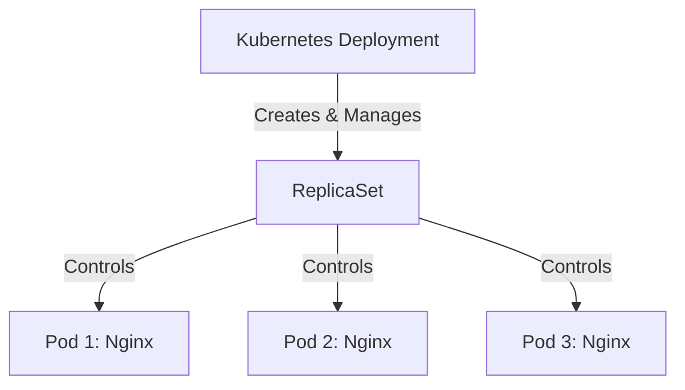

# 🚢 Kubernetes Deployment Mastery

[](https://github.com/TheToriqul/k8s-deployment)


## 📋 Project Overview

This project demonstrates advanced Kubernetes deployment capabilities, showcasing both declarative and imperative approaches to managing containerized applications. Through this implementation, I've developed a deep understanding of Kubernetes Deployments, ReplicaSets, and Pod management, using Nginx as the example application.

## 🎯 Key Objectives

- Implement production-grade Kubernetes Deployments using both declarative and imperative approaches
- Master Pod lifecycle management and scaling strategies
- Develop expertise in Kubernetes manifest creation and management
- Establish best practices for container orchestration
- Gain hands-on experience with real-world deployment scenarios

## 🏗️ Project Architecture
The architecture implements a Kubernetes Deployment that manages a single ReplicaSet, which in turn maintains three identical Nginx pods running the latest Nginx image. Each pod runs a containerized Nginx web server exposing port 80, while the ReplicaSet ensures that the specified number of replicas (3) is maintained at all times.


## 💻 Technical Stack

- **Container Orchestration**: Kubernetes
- **Container Runtime**: Docker
- **Web Server**: Nginx
- **Infrastructure**: kubectl, Linux

## 🚀 Getting Started

<details>
<summary>🐳 Prerequisites</summary>

- Kubernetes cluster (local or cloud-based)
- kubectl CLI tool installed
- Docker installed
- Basic understanding of container orchestration
- vim text editor (optional)

</details>

<details>
<summary>⚙️ Installation</summary>

1. Clone the repository:
   ```bash
   git clone https://github.com/TheToriqul/k8s-deployment.git
   ```
2. Navigate to the project directory:
   ```bash
   cd k8s-deployment
   ```
3. Ensure kubectl is properly configured:
   ```bash
   kubectl cluster-info
   ```

</details>

<details>
<summary>🎮 Usage</summary>

### Declarative Approach
1. Apply the deployment configuration:
   ```bash
   kubectl apply -f deployment-definition.yaml
   ```

### Imperative Approach
1. Create deployment directly:
   ```bash
   kubectl create deployment nginx-deployment --image=nginx:latest --replicas=3 --port=80
   ```

For detailed commands and explanations, refer to the [reference-commands.md](reference-commands.md) file.

</details>

## 💡 Key Learnings

### Technical Mastery:

1. Advanced Kubernetes Deployment configurations and management
2. Container orchestration patterns and best practices
3. Declarative vs. Imperative deployment approaches
4. Pod lifecycle management and scaling strategies
5. Kubernetes manifest structure and syntax

### Professional Development:

1. Infrastructure as Code (IaC) principles
2. DevOps best practices
3. Production deployment strategies
4. System architecture design
5. Technical documentation skills

### 🔄 Future Enhancements

<details>
<summary>View Planned Improvements</summary>

1. Implement rolling update strategies
2. Add health checks and readiness probes
3. Integrate with CI/CD pipelines
4. Implement resource quotas and limits
5. Add monitoring and logging capabilities
6. Develop automated scaling policies

</details>

## 🙌 Contribution

Contributions are welcome! Feel free to [open an issue](https://github.com/TheToriqul/k8s-deployment/issues) or submit a [pull request](https://github.com/TheToriqul/k8s-deployment/pulls) to suggest improvements or add features.

## 📧 Connect with Me

- 📧 Email: toriqul.int@gmail.com
- 📱 Phone: +65 8936 7705, +8801765 939006
- 🌐 LinkedIn: [@TheToriqul](https://www.linkedin.com/in/thetoriqul/)
- 🐙 GitHub: [@TheToriqul](https://github.com/TheToriqul)
- 🌍 Portfolio: [TheToriqul.com](https://thetoriqul.com)

Let's connect and discuss cloud-native technologies!

## 👏 Acknowledgments

- Poridhi for providing comprehensive labs and inspiring this project
- The Kubernetes community for excellent documentation and resources
- The open-source community for continuous inspiration and support

---

Thank you for exploring my Kubernetes Deployment project. I hope you find it helpful in your own cloud-native journey! 🚀